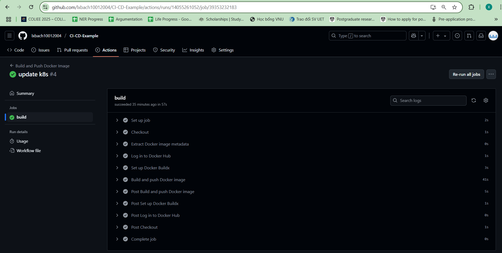
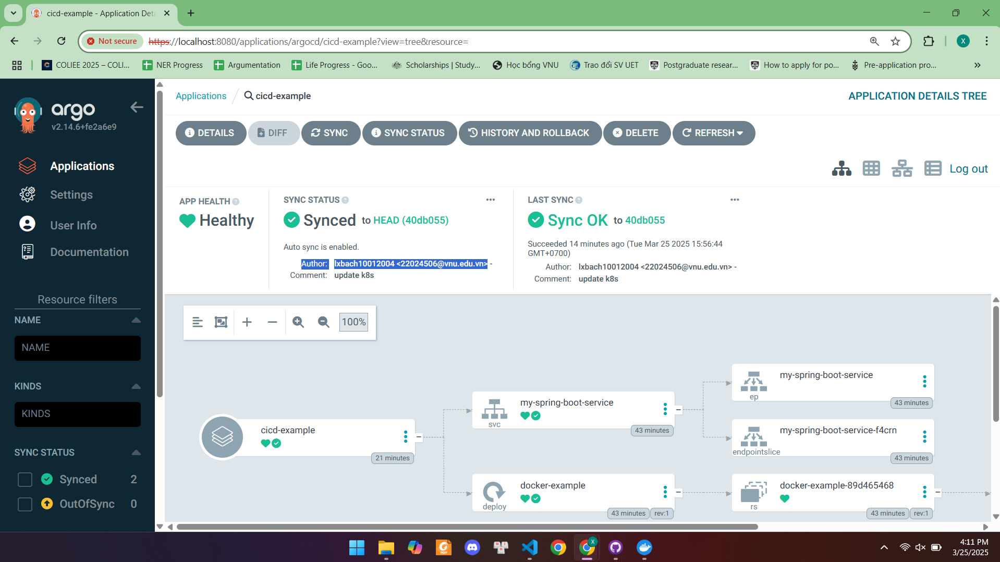
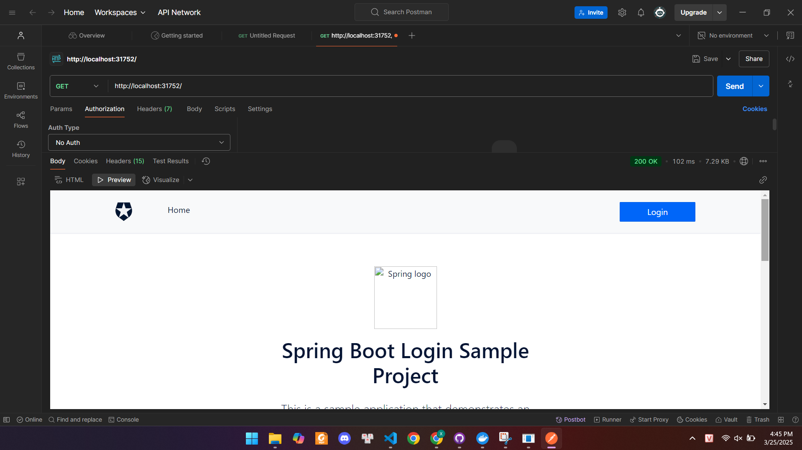

# Spring Boot Đăng nhập - MVC với Docker Desktop, Kubernetes, GitHub Actions và ArgoCD

- Thêm xác thực với Auth0 bằng [Okta Spring Boot Starter](https://github.com/okta/okta-spring-boot) vào ứng dụng Spring Boot MVC.
- Triển khai tự động với GitHub Actions và ArgoCD.

## Yêu cầu

- Java 17
- Docker Desktop
- Kubernetes (K8s) đã được cài đặt
- GitHub Actions để CI/CD
- ArgoCD để triển khai tự động

## Cài đặt Auth0

1. Truy cập [Auth0 Dashboard](https://manage.auth0.com/#/clients), tạo một ứng dụng mới với loại **Regular Web Application**.
2. Trong tab **Settings**, thêm `http://localhost:3000/login/oauth2/code/okta` vào **Allowed Callback URLs**.
3. Thêm `http://localhost:3000/` vào **Allowed Logout URLs**.
4. Lưu thay đổi và lưu lại Client ID, Client Secret, Issuer URI.

Cấu hình trong `src/main/resources/application.yml`:

```yaml
client-id: {YOUR-CLIENT-ID}
client-secret: {YOUR-CLIENT-SECRET}
issuer-uri: https://{YOUR-DOMAIN}/
```

---

## 1. Triển khai với GitHub Actions

### 1.1. Tạo workflow GitHub Actions

Trong repo GitHub, tạo tệp `.github/workflows/docker-ci.yml`:

```yaml
name: Build and Push Docker Image

on:
  push:
    branches:
      - main
  pull_request:

jobs:
  build:
    runs-on: ubuntu-latest
    steps:
      - name: Checkout
        uses: actions/checkout@v4

      - name: Extract Docker image metadata
        id: meta
        uses: docker/metadata-action@v5
        with:
          images: ${{ vars.DOCKER_USERNAME }}/my-image

      - name: Log in to Docker Hub
        uses: docker/login-action@v3
        with:
          username: ${{ vars.DOCKER_USERNAME }}
          password: ${{ secrets.DOCKER_PASSWORD }}

      - name: Set up Docker Buildx
        uses: docker/setup-buildx-action@v3
      
      - name: Build and push Docker image
        uses: docker/build-push-action@v6
        with:
          push: ${{ github.event_name != 'pull_request' }}
          tags: ${{ steps.meta.outputs.tags }}
          annotations: ${{ steps.meta.outputs.annotations }}
          provenance: true
          sbom: true
```

### 1.2. Kết quả GitHub Actions



---

## 2. Triển khai với Kubernetes

### 2.1. Tạo Deployment và Service

Tạo `k8s/deployment.yaml`:

```yaml
apiVersion: apps/v1
kind: Deployment
metadata:
  name: docker-example
spec:
  replicas: 1
  selector:
    matchLabels:
      app: docker-example
  template:
    metadata:
      labels:
        app: docker-example
    spec:
      containers:
        - name: docker-example
          image: lxbach10012004/docker-example:latest
          ports:
            - containerPort: 3000
```

Tạo `k8s/service.yaml`:

```yaml

apiVersion: v1
kind: Service
metadata:
  name: my-spring-boot-service
spec:
  selector:
    app: docker-example
  ports:
    - protocol: TCP
      port: 80
      targetPort: 3000
  type: NodePort
```

### 2.2. Áp dụng Kubernetes

```bash
kubectl apply -f deployment.yaml
kubectl apply -f service.yaml
```

Kiểm tra:

```bash
kubectl get all
```

Tìm cổng NodePort và truy cập ứng dụng tại `http://localhost:{NODE_PORT}`.

---

## 3. Triển khai tự động với ArgoCD

### 3.1. Cài đặt ArgoCD

```bash
kubectl create namespace argocd
kubectl apply -n argocd -f https://raw.githubusercontent.com/argoproj/argo-cd/stable/manifests/install.yaml
```

### 3.2. Lấy mật khẩu admin ArgoCD

```bash
kubectl get secret argocd-initial-admin-secret -n argocd -o jsonpath="{.data.password}" | ForEach-Object { [System.Text.Encoding]::UTF8.GetString([System.Convert]::FromBase64String($_)) }
```

### 3.3. Truy cập giao diện ArgoCD

```bash
kubectl port-forward svc/argocd-server -n argocd 8080:443
```

Mở trình duyệt: [https://localhost:8080](https://localhost:8080), đăng nhập với user `admin` và mật khẩu đã lấy.

### 3.4. Tạo Application trong ArgoCD

```yaml
apiVersion: argoproj.io/v1alpha1
kind: Application
metadata:
  name: my-app
  namespace: argocd
spec:
  destination:
    namespace: default
    server: https://kubernetes.default.svc
  source:
    repoURL: 'https://github.com/your-username/your-repo.git'
    targetRevision: HEAD
    path: k8s
  project: default
  syncPolicy:
    automated:
      selfHeal: true
      prune: true
```

Triển khai application:

```bash
kubectl apply -f argocd-app.yaml
```

### 3.5. Kết quả ArgoCD



---

## 4. Kiểm tra API bằng Postman
Sau khi triển khai thành công, có thể dùng **Postman** để kiểm tra API:
- **Gửi yêu cầu GET:** `http://localhost:{NODE_PORT}`

### 4.1. Kết quả

---
Bài làm của: **Lê Xuân Bách** - MSV 22024506

