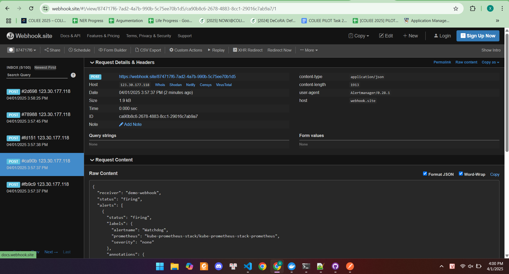

# Monitoring Spring Boot trên Kubernetes với Prometheus, Grafana và Alertmanager

## 1. Giới thiệu
Cách thiết lập hệ thống giám sát (monitoring) cho ứng dụng Spring Boot chạy trên Kubernetes bằng Prometheus, Grafana và Alertmanager.

## 2. Cài đặt kube-prometheus-stack

### 2.1. Thêm Helm repo và cập nhật
```bash
helm repo add prometheus-community https://prometheus-community.github.io/helm-charts
helm repo update
```

### 2.2. Cài đặt kube-prometheus-stack
```bash
helm install kube-prometheus-stack prometheus-community/kube-prometheus-stack -n kube-prometheus-stack --create-namespace
```

## 3. Truy cập các dịch vụ monitoring

### 3.1. Prometheus (Port 9090)
```bash
kubectl port-forward svc/kube-prometheus-stack-prometheus -n kube-prometheus-stack 9090:9090
```
Mở trình duyệt và truy cập: [http://localhost:9090](http://localhost:9090)

**Kết quả:**


### 3.2. Grafana (Port 8080)
```bash
kubectl port-forward svc/kube-prometheus-stack-grafana -n kube-prometheus-stack 8080:80
```
Đăng nhập Grafana với:
- Username: `admin`
- Password: Lấy bằng lệnh:
```bash
kubectl get secret --namespace kube-prometheus-stack kube-prometheus-stack-grafana -o jsonpath="{.data.admin-password}" | base64 --decode
```

Mở trình duyệt và truy cập: [http://localhost:8080](http://localhost:8080)

**Kết quả:**


### 3.3. Alertmanager (Port 9093)
```bash
kubectl port-forward svc/kube-prometheus-stack-alertmanager -n kube-prometheus-stack 9093:9093
```
Mở trình duyệt và truy cập: [http://localhost:9093](http://localhost:9093)

**Kết quả:**


## 4. Cấu hình Alertmanager để gửi cảnh báo qua Webhook và Email

### 4.1. Sửa file cấu hình `alertmanager-config.yaml`
```yaml
alertmanager:
  config:
    global:
      resolve_timeout: 5m
      smtp_smarthost: 'smtp.gmail.com:587'  # Replace with your SMTP server
      smtp_from: 'bachlx2004@gmail.com'  # Sender email
      smtp_auth_username: 'bachlx2004@gmail.com'
      smtp_auth_password: '###'  # Use an app password if needed
      smtp_require_tls: true  # Ensure TLS security

    route:
      receiver: demo-webhook
      group_wait: 5s
      group_interval: 10s
      repeat_interval: 1h
      routes:
        - receiver: email-notifications
          match:
            severity: critical  # Only send critical alerts to email

    receivers:
      - name: "null"
      - name: demo-webhook
        webhook_configs:
          - url: http://example.com/webhook
            send_resolved: true
      - name: email-notifications
        email_configs:
          - to: 'bachlx2004@gmail.com'  # Replace with the actual recipient
            send_resolved: true
```

### 4.2. Áp dụng cấu hình với Helm
```bash
helm upgrade kube-prometheus-stack prometheus-community/kube-prometheus-stack \
  --reuse-values -f alertmanager-config.yaml -n kube-prometheus-stack
```

### 4.3. Kết quả
- **Alert gửi về webhook**
  
- **Alert gửi về email**
  

---
Bài làm của: **Lê Xuân Bách** - MSV 22024506

